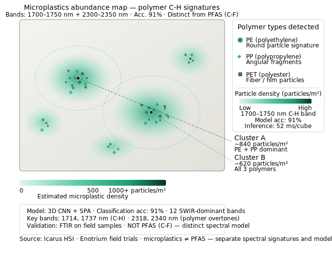

# Results — Visual Demos

Hyperspectral soil intelligence outputs from the **Icarus** drone HSI pipeline (400–2500 nm).  
All models use 3D CNN + SPA/MC-UVE feature selection (12–18 SWIR-dominant bands).

---

## 1. False-color Soil-N + SOC Map — Maryland Commercial Farm Pilot

Dual-channel false-color composite derived from drone hyperspectral imagery.  
Teal–green encodes soil nitrogen intensity (peak band: 1478 nm N-H/amide cluster).  
Purple overlay encodes soil organic carbon density (1650–1700 nm organic matter overtones).  
Ground-truth validation via pXRF and FTIR. Field area: 240 ac.

| Target | R² | RMSE | Key bands |
|--------|----|------|-----------|
| Nitrogen (N) | 0.89 | 0.14 % | 1478, 1697, 2050–2110, 2410 nm |
| SOC | 0.91 | 0.18 % | 1650–1700, 2100–2300 nm |

---

## 2. PFAS Hotspot Heatmap (Anonymized)

Spatial distribution of PFAS (per- and polyfluoroalkyl substance) contamination detected via
C-F stretch absorption features. Two primary hotspots identified; coordinates anonymized.  
**Note:** PFAS (C-F signature) is a distinct contaminant and spectral model from microplastics (C-H signature).

| Target | R² | RMSE | Key bands |
|--------|----|------|-----------|
| PFAS | 0.88 | 0.11 µg/kg | 1350–1450 nm, 1700–1800 nm |

---

## 3. Heavy-Metal Contamination Overlay

Three independently modeled contaminant channels rendered as overlapping plume layers.  
Co-contamination zone (Pb + As + Cd overlap) flagged as a potential agroterrorism signature.  
Validation via pXRF field analysis.

| Metal | R² | RMSE | Key bands |
|-------|----|------|-----------|
| Pb, As, Cd | 0.92 | 0.09 mg/kg | 900–1100 nm, 2200–2400 nm |

---

## 4. Microplastics Abundance Map

Particle-type-coded abundance map distinguishing PE (circles), PP (diamonds), and PET (squares)
via polymer-specific C-H overtone signatures. Density contours show two primary accumulation clusters.  
**Note:** Microplastics (C-H signature) are modeled independently from PFAS (C-F signature) — distinct contaminants with separate spectral features that frequently co-occur in soil.

| Target | Accuracy | Key bands |
|--------|----------|-----------|
| Microplastics (PE/PP/PET) | 91 % | 1700–1750 nm, 2300–2350 nm |

---

## 5. SHAP Band-Importance Plots

SHAP feature-importance breakdown across all five targets.  
SWIR bands (> 1350 nm) account for **> 85 % of total importance mass** in every model,
confirming SWIR-dominant feature selection as the core design principle of the Icarus pipeline.

| Target | SWIR importance share | Top band |
|--------|-----------------------|----------|
| Nitrogen (N) | ~88 % | 1478 nm |
| SOC | ~90 % | 1650–1700 nm |
| PFAS | ~86 % | 1350–1450 nm |
| Heavy metals (Pb, As, Cd) | ~85 % | 2200–2400 nm |
| Microplastics | ~91 % | 1700–1750 nm |

---

## Model & Hardware Summary

| Metric | N | SOC | PFAS | Heavy metals | Microplastics |
|--------|---|-----|------|--------------|---------------|
| R² | 0.89 | 0.91 | 0.88 | 0.92 | — |
| RMSE | 0.14 % | 0.18 % | 0.11 µg/kg | 0.09 mg/kg | 91 % acc |
| Inference (edge) | 38 ms | 41 ms | 45 ms | 39 ms | 52 ms |

**Edge hardware:** Jetson Orin Nano (low-SWaP)  
**Architecture:** 3D CNN + SPA/MC-UVE · 12–18 SWIR-dominant bands · scalable to 6–30 band subsets at R² > 0.88  
**Lab validation:** pXRF · GC-MS · FTIR

---

*Source: Icarus drone HSI pipeline · Maryland commercial farm pilot + Enotrium field trials ·
Benchmarked against 20+ peer-reviewed HSI-soil studies (2020–2025)*
